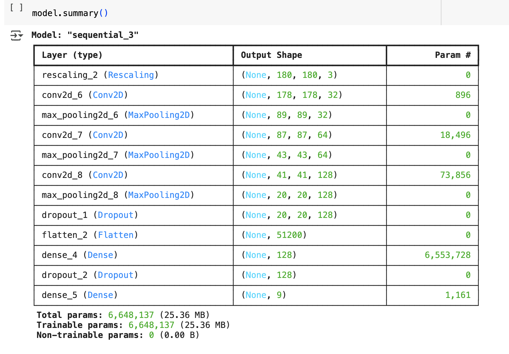

# Melanoma Skin Cancer Detection

## Abstract

In the realm of cancer, there exist over 200 distinct forms, with melanoma standing out as the most lethal type of skin cancer among them. The diagnostic protocol for melanoma typically initiates with clinical screening, followed by dermoscopic analysis and histopathological examination. Early detection of melanoma skin cancer is pivotal, as it significantly enhances the chances of successful treatment. The initial step in diagnosing melanoma skin cancer involves visually inspecting the affected area of the skin. Dermatologists capture dermatoscopic images of the skin lesions using high-speed cameras, which yield diagnostic accuracies ranging from 65% to 80% for melanoma without supplementary technical assistance. Through further visual assessment by oncologists and dermatoscopic image analysis, the overall predictive accuracy of melanoma diagnosis can be elevated to 75% to 84%. The objective of the project is to construct an automated classification system leveraging image processing techniques to classify skin cancer based on images of skin lesions.

## Problem statement

To build a CNN based model which can accurately detect melanoma. Melanoma is a type of cancer that can be deadly if not detected early. It accounts for 75% of skin cancer deaths. A solution which can evaluate images and alert the dermatologists about the presence of melanoma has the potential to reduce a lot of manual effort needed in diagnosis.

## Table of Contents

- [General Info](#general-information)
- [Model Architecture](#model-architecture)
- [Model Summary](#model-summary)
- [Model Evaluation](#model-evaluation)
- [Technologies Used](#technologies-used)
- [Acknowledgements](#acknowledgements)
- [Collaborators](#collaborators)

<!-- You can include any other section that is pertinent to your problem -->

## General Information

The dataset comprises 2357 images depicting malignant and benign oncological conditions, sourced from the International Skin Imaging Collaboration (ISIC). These images were categorized based on the classification provided by ISIC, with each subset containing an equal number of images.

In order to address the challenge of class imbalance, the Augmentor Python package (https://augmentor.readthedocs.io/en/master/) was employed to augment the dataset. This involved generating additional samples for all classes, ensuring that none of the classes had insufficient representation.

## Pictorial representation of skin types

The aim of this task is to assign a specific class label to a particular type of skin cancer.

## Model Architecture

To classify skin cancer using skin lesions images. To achieve higher accuracy and results on the classification task, I have built a CNN model.

- Rescalling Layer - To rescale an input in the [0, 255] range to be in the [0, 1] range.
- Convolutional Layer - Convolutional layers apply a convolution operation to the input, passing the result to the next layer. A convolution converts all the pixels in its receptive field into a single value. For example, if you would apply a convolution to an image, you will be decreasing the image size as well as bringing all the information in the field together into a single pixel. 
- Pooling Layer - Pooling layers are used to reduce the dimensions of the feature maps. Thus, it reduces the number of parameters to learn and the amount of computation performed in the network. The pooling layer summarises the features present in a region of the feature map generated by a convolution layer.
- Dropout Layer - The Dropout layer randomly sets input units to 0 with a frequency of rate at each step during training time, which helps prevent overfitting.
- Flatten Layer - Flattening is converting the data into a 1-dimensional array for inputting it to the next layer. We flatten the output of the convolutional layers to create a single long feature vector. And it is connected to the final classification model, which is called a fully-connected layer.
- Dense Layer - The dense layer is a neural network layer that is connected deeply, which means each neuron in the dense layer receives input from all neurons of its previous layer.
- Activation Function(ReLU) - The rectified linear activation function or ReLU for short is a piecewise linear function that will output the input directly if it is positive, otherwise, it will output zero.The rectified linear activation function overcomes the vanishing gradient problem, allowing models to learn faster and perform better.
- Activation Function(Softmax) - The softmax function is used as the activation function in the output layer of neural network models that predict the output probability distribution. The main advantage of using Softmax is the output probabilities range. The range will 0 to 1, and the sum of all the probabilities will be equal to one.

## Model Summary

## Model Evaluation

## Technologies Used

- [Python](https://www.python.org/) - version 3.11.4
- [Matplotlib](https://matplotlib.org/) - version 3.7.1
- [Numpy](https://numpy.org/) - version 1.24.3
- [Pandas](https://pandas.pydata.org/) - version 1.5.3
- [Seaborn](https://seaborn.pydata.org/) - version 0.12.2
- [Tensorflow](https://www.tensorflow.org/) - version 2.17.0

<!-- As the libraries versions keep on changing, it is recommended to mention the version of library used in this project -->

## Acknowledgements

- [Melanoma Skin Cancer](https://www.cancer.org/cancer/melanoma-skin-cancer/about/what-is-melanoma.html)

- [Introduction to CNN](https://www.analyticsvidhya.com/blog/2021/05/convolutional-neural-networks-cnn/)

- [Image classification using CNN](https://www.analyticsvidhya.com/blog/2020/02/learn-image-classification-cnn-convolutional-neural-networks-3-datasets/)

- [Efficient way to build CNN architecture](https://towardsdatascience.com/a-guide-to-an-efficient-way-to-build-neural-network-architectures-part-ii-hyper-parameter-42efca01e5d7)
